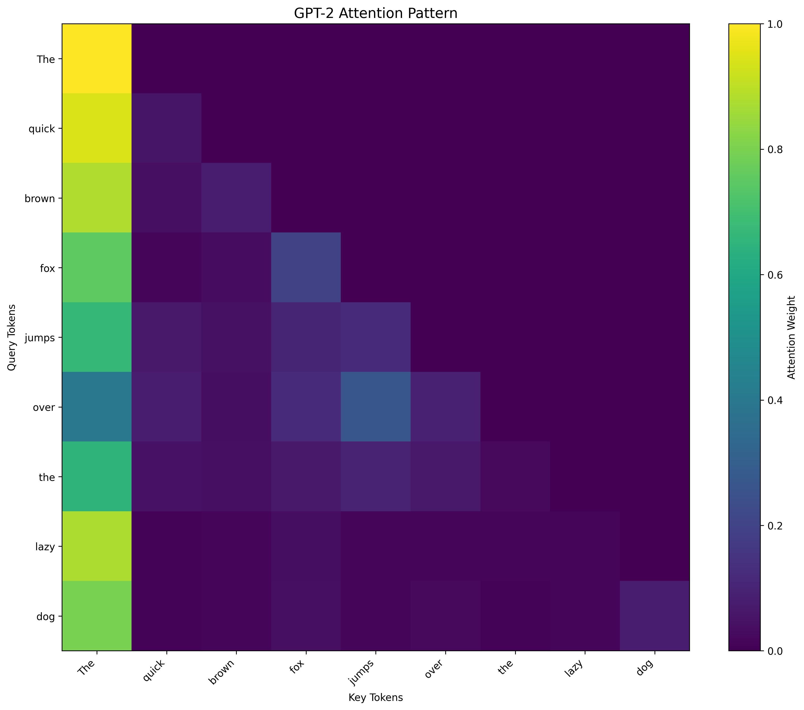
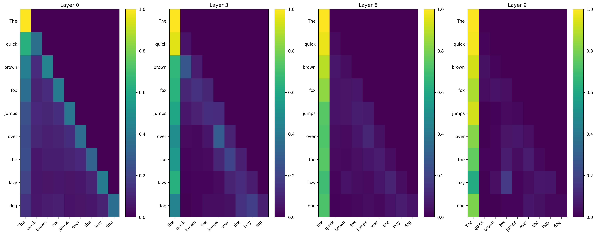
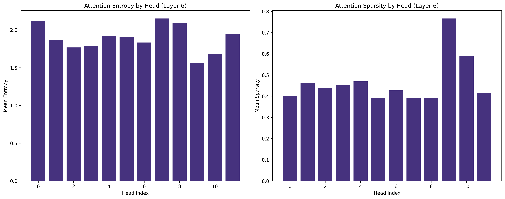

# Attention Viz 🔍

A comprehensive toolkit for visualizing and inspecting attention patterns in transformer models. This module provides intuitive visualizations and analysis tools to understand how attention mechanisms work in Large Language Models (LLMs) and other transformer architectures.

Built with a modular, research-ready architecture that supports multiple visualization backends, advanced analysis techniques, and seamless integration with popular transformer libraries.

## 🏗️ Library Architecture

This library is built with a clean, modular architecture:

```
attention_viz/
├── core/                    # Core functionality
│   ├── extractor.py        # Attention weight extraction from any transformer
│   ├── visualizer.py       # Main visualization engine (interactive + static)
│   └── analyzer.py         # Advanced analysis tools (flow, clustering, etc.)
├── utils/                   # Utility modules  
│   ├── config.py          # Configuration management
│   └── helpers.py         # Model loading and data handling utilities
└── cli.py                  # Command-line interface
```

### Key Components

- **`AttentionExtractor`**: Universal attention weight extraction from any transformer model
- **`AttentionVisualizer`**: Rich visualization engine with both interactive (Plotly) and static (Matplotlib) outputs
- **`AttentionAnalyzer`**: Advanced analysis including attention flow, head clustering, and positional patterns
- **Configuration System**: Flexible YAML-based configuration for all settings
- **CLI Interface**: Command-line tools for quick analysis and batch processing

## Features ✨

- **Multi-Head Attention Visualization**: Interactive heatmaps for attention weights across different heads and layers
- **Token-to-Token Attention**: Detailed attention flow between input tokens
- **Layer-wise Analysis**: Compare attention patterns across different transformer layers
- **Head Specialization**: Analyze what different attention heads focus on
- **Attention Statistics**: Quantitative metrics for attention distribution and entropy
- **Interactive Plots**: Zoom, filter, and explore attention patterns dynamically
- **Export Capabilities**: Save visualizations and attention data for further analysis
- **Model Agnostic**: Support for various transformer architectures (BERT, GPT, T5, etc.)
- **Advanced Analysis**: Attention flow analysis, positional patterns, and head clustering
- **Professional Tooling**: CLI interface, comprehensive testing, and flexible configuration

## Gallery 🖼️

Here are some example visualizations generated by the library:

### Attention Heatmap
Static visualization showing attention patterns between tokens:


### Multi-Layer Comparison
Compare attention patterns across different transformer layers:


### Head Specialization Analysis
Analyze what different attention heads focus on:


### Interactive Visualizations
The library also generates interactive HTML visualizations with zoom, hover, and filtering capabilities (example: `basic_attention.html` - 4.4MB interactive plot).

*All examples generated using GPT-2 model with the text: "The quick brown fox jumps over the lazy dog"*

## Installation 📦

### From Source
```bash
git clone https://github.com/HarivRangarajan/attention_viz.git
cd attention_viz
pip install -e .
```

### Install Dependencies
```bash
pip install -r requirements.txt
```

### Requirements
- Python 3.8+
- PyTorch 1.9+
- Transformers 4.0+
- Matplotlib 3.0+
- Plotly 5.0+
- NumPy, Pandas, Seaborn
- Inspectus (optional, for advanced visualizations)
- Scikit-learn (for clustering analysis)

## Environment Setup & Testing 🧪

### Recommended: Python 3.10 Virtual Environment

For the best compatibility with all dependencies (especially PyTorch), we recommend using Python 3.10:

```bash
# Create virtual environment with Python 3.10
python3.10 -m venv attnviz

# Activate the environment
source attnviz/bin/activate  # On macOS/Linux
# or
attnviz\Scripts\activate     # On Windows

# Upgrade pip
pip install --upgrade pip

# Install PyTorch first (better compatibility with Python 3.10)
pip install torch torchvision torchaudio

# Install all other requirements
pip install -r requirements.txt

# Install the library in development mode
pip install -e .

# Fix NumPy compatibility if needed
pip install "numpy<2"
```

### Testing Your Installation

1. **Test Basic Import**:
```bash
python -c "import attention_viz; print('✅ attention_viz imported successfully!')"
```

2. **Test CLI Interface**:
```bash
attention-viz --help
```

3. **Run Complete Example**:
```bash
python examples/basic_usage.py
```

Expected output should include:
```
🔍 Attention Viz - Basic Usage Example
==================================================

1. Loading GPT-2 model and tokenizer...
✅ Loaded gpt2

2. Initializing attention visualizer...
✅ Visualizer initialized

3. Analyzing text: 'The quick brown fox jumps over the lazy dog'

4. Creating basic attention visualization...
✅ Basic visualization saved to examples/outputs/basic_attention.html

...

🎉 Example completed! Check the examples/outputs/ directory for results.
```

4. **Verify Outputs**:
```bash
ls examples/outputs/
```

You should see files like:
- `basic_attention.html` - Interactive attention visualization
- `attention_heatmap.png` - Static heatmap plot  
- `layer_comparison.png` - Multi-layer comparison
- `attention_data.json` - Exported attention weights
- `attention_report.md` - Analysis report
- `head_specialization.png` - Head analysis plot
- `inspectus_plots/` - Directory with inspectus visualizations

### Troubleshooting

**NumPy Compatibility Warning**: If you see NumPy-related warnings with PyTorch, run:
```bash
pip install "numpy<2"
```

**CUDA Issues**: For GPU support, install PyTorch with CUDA:
```bash
pip install torch torchvision torchaudio --index-url https://download.pytorch.org/whl/cu118
```

**Memory Issues**: If you encounter out-of-memory errors, try:
- Using smaller models (e.g., `distilgpt2` instead of `gpt2`)
- Reducing sequence length in the config
- Using CPU instead of GPU: `device='cpu'`

## Quick Start 🚀

### Simple Usage
```python
from attention_viz import AttentionVisualizer, load_model_and_tokenizer

# Load any transformer model (GPT-2, BERT, RoBERTa, T5, etc.)
model, tokenizer = load_model_and_tokenizer("gpt2")

# Initialize visualizer
viz = AttentionVisualizer(model, tokenizer)

# Visualize attention for a sample text
text = "The quick brown fox jumps over the lazy dog"
viz.visualize_attention(text, layer=6, head=4, save_path="attention_plot.html")
```

### Advanced Analysis
```python
from attention_viz import AttentionAnalyzer

# Create analyzer for advanced techniques
analyzer = AttentionAnalyzer(viz.extractor)

# Analyze attention flow patterns
flow_analysis = analyzer.analyze_attention_flow(text, layer=6)
print(f"Attention hubs: {flow_analysis['aggregate_flows']['global_hubs']}")

# Positional attention analysis (local vs global patterns)
pos_analysis = analyzer.analyze_positional_attention(text, layer=6)
print(f"Pattern type: {pos_analysis['aggregate_analysis']['attention_pattern_type']}")

# Generate comprehensive analysis report
analyzer.export_analysis_report(text, "attention_report.md")
```

## Usage Examples 📖

### Basic Attention Heatmap
```python
# Generate attention heatmap for specific layer and head
viz.plot_attention_heatmap(
    text="Hello world, this is a test sentence.",
    layer=6,
    head=8,
    title="Layer 6, Head 8 Attention Pattern",
    save_path="heatmap.png"
)
```

### Multi-Layer Comparison
```python
# Compare attention patterns across layers
viz.compare_layers(
    text="Attention is all you need for transformers.",
    layers=[0, 6, 11],
    save_path="layer_comparison.png"
)
```

### Attention Statistics
```python
# Get comprehensive quantitative attention metrics
stats = viz.get_attention_stats("Sample text for analysis")
print(f"Overall entropy: {stats['overall_stats']['entropy']:.4f}")
print(f"Overall sparsity: {stats['overall_stats']['sparsity']:.4f}")
print(f"Max attention weight: {stats['overall_stats']['max_attention']:.4f}")

# Layer-specific statistics
for layer_stat in stats['layer_stats'][:3]:
    print(f"Layer {layer_stat['layer']}: entropy={layer_stat['entropy']:.4f}")
```

### Head Specialization Analysis
```python
# Analyze what different heads focus on across multiple texts
texts = [
    "The cat sat on the mat",
    "Machine learning is fascinating", 
    "Attention mechanisms are powerful"
]

head_analysis = viz.analyze_head_specialization(texts=texts, layer=8)
viz.plot_head_specialization(head_analysis, save_path="head_specialization.png")
```

### Using Inspectus Integration
```python
# Advanced visualizations using inspectus library (like the original implementation)
viz.use_inspectus_visualization(
    text="Sample text for detailed analysis",
    chart_types=['attention_matrix', 'query_token_heatmap', 'key_token_heatmap'],
    color_scheme={
        'query_token_heatmap': 'orange',
        'key_token_heatmap': 'green'
    },
    save_dir="inspectus_outputs"
)
```

### Command Line Interface
```bash
# Quick visualization
attention-viz visualize --model gpt2 --text "Hello world" --layer 6 --head 4 --output viz.html

# Generate analysis report  
attention-viz analyze --model gpt2 --text "Sample text" --output report.md

# Compare multiple layers
attention-viz compare --model gpt2 --text "Sample text" --layers 0 3 6 9 --output comparison.png

# Get attention statistics
attention-viz stats --model bert-base-uncased --text "The quick brown fox"
```

## Visualization Types 📊

### 1. Attention Heatmaps
- **Token-to-token attention matrices**
- **Customizable color schemes**
- **Interactive hover information**
- **Layer and head-specific views**

### 2. Attention Flow Diagrams
- **Sankey diagrams for attention flow**
- **Token importance visualization**
- **Hierarchical attention patterns**
- **Attention hub identification**

### 3. Statistical Plots
- **Attention distribution histograms**
- **Entropy analysis across layers/heads**
- **Attention weight statistics**
- **Sparsity analysis**

### 4. Comparative Analysis
- **Side-by-side layer comparisons**
- **Head behavior analysis**
- **Token importance ranking**
- **Cross-model comparisons**

### 5. Advanced Analysis
- **Positional attention patterns** (local vs global)
- **Head clustering and specialization**
- **Attention flow analysis**
- **Statistical summarization**

## Supported Models 🤖

The library works with any transformer model that outputs attention weights:

- **GPT Family**: gpt2, gpt2-medium, gpt2-large, gpt2-xl
- **BERT Family**: bert-base-uncased, bert-large-uncased, distilbert-base-uncased
- **RoBERTa Family**: roberta-base, roberta-large
- **T5 Family**: t5-small, t5-base, t5-large
- **ALBERT**: albert-base-v2, albert-large-v2
- **Custom Models**: Any transformer with attention output enabled

## API Reference 📚

### AttentionVisualizer Class

```python
class AttentionVisualizer:
    def __init__(self, model, tokenizer, device='auto', config=None):
        """Initialize the attention visualizer."""
        
    def visualize_attention(self, text, layer=None, head=None, save_path=None, interactive=True):
        """Main visualization method with interactive/static options."""
        
    def plot_attention_heatmap(self, text, layer, head, title=None, figsize=(12,10), save_path=None):
        """Generate static attention heatmap."""
        
    def compare_layers(self, text, layers, head=None, save_path=None):
        """Compare attention across multiple layers."""
        
    def get_attention_stats(self, text):
        """Get comprehensive statistical measures of attention."""
        
    def analyze_head_specialization(self, texts, layer, save_path=None):
        """Analyze head specialization across multiple texts."""
        
    def export_attention_data(self, text, format='json', save_path=None):
        """Export attention weights and metadata."""
        
    def use_inspectus_visualization(self, text, chart_types=None, color_scheme='viridis', save_dir=None):
        """Use inspectus library for advanced visualizations."""
```

### AttentionAnalyzer Class

```python
class AttentionAnalyzer:
    def __init__(self, extractor):
        """Initialize with an AttentionExtractor instance."""
        
    def analyze_attention_flow(self, text, layer):
        """Analyze attention flow patterns (hubs, sources, concentration)."""
        
    def analyze_positional_attention(self, text, layer):
        """Analyze local vs global attention patterns."""
        
    def cluster_attention_heads(self, texts, layer, n_clusters=3):
        """Cluster attention heads based on their patterns."""
        
    def compare_attention_patterns(self, texts, layers=None):
        """Compare attention patterns across texts and layers."""
        
    def generate_attention_summary(self, text):
        """Generate comprehensive attention analysis summary."""
        
    def export_analysis_report(self, text, save_path):
        """Export detailed analysis report in Markdown format."""
```

## Configuration ⚙️

Create a `attention_viz_config.yaml` file to customize default settings:

```yaml
visualization:
  default_colormap: "viridis"
  figure_size: [12, 8]
  dpi: 300
  interactive: true
  save_format: "png"
  
export:
  default_format: "json"
  include_metadata: true
  compression: false
  
model:
  max_length: 512
  batch_size: 1
  device: "auto"
  cache_attention: true
```

## Development & Testing 🛠️

### Development Setup
```bash
git clone https://github.com/HarivRangarajan/attention_viz.git
cd attention_viz
pip install -e ".[dev]"
```

### Running Tests
```bash
python -m pytest tests/ -v
```

### Running Examples
```bash
python examples/basic_usage.py
```

## Examples and Tutorials 📓

Check out the `examples/` directory for comprehensive demonstrations:
- **Basic Usage**: `examples/basic_usage.py` - Complete walkthrough of all features
- **Advanced Analysis**: Attention flow, head clustering, positional analysis
- **Custom Model Integration**: Working with different transformer architectures
- **Batch Processing**: Analyzing multiple texts efficiently

## Key Improvements Over Basic Attention Visualization ⭐

1. **Modular Architecture**: Clean separation of extraction, visualization, and analysis
2. **Multiple Model Support**: Works seamlessly with GPT-2, BERT, RoBERTa, T5, and more
3. **Rich Visualizations**: Both interactive (Plotly) and static (Matplotlib) options
4. **Advanced Analysis**: Statistical analysis, flow patterns, head specialization
5. **Professional Tooling**: CLI interface, comprehensive testing, flexible configuration
6. **Research-Ready**: Export capabilities, batch processing, detailed reporting
7. **Extensible Design**: Easy to add new visualization types and analysis methods

## Research Applications 🔬

This tool has been designed for research applications including:
- Understanding attention patterns in different model architectures
- Analyzing linguistic phenomena captured by attention heads
- Debugging model behavior and interpretability studies
- Comparing attention mechanisms across different training strategies
- Head pruning and model compression research
- Cross-lingual attention pattern analysis

## Contributing 🤝

We welcome contributions! Please see our [Contributing Guide](CONTRIBUTING.md) for details.

### Development Setup
```bash
git clone https://github.com/HarivRangarajan/attention_viz.git
cd attention_viz
pip install -e ".[dev]"
pre-commit install
```

### Running Tests
```bash
pytest tests/
```

## Citing 📄

If you use this tool in your research, please cite:

```bibtex
@software{attention_viz,
  title={Attention Viz: A Toolkit for Transformer Attention Visualization},
  author={Harivallabha Rangarajan and Aditya Shrivastava},
  year={2024},
  url={https://github.com/HarivRangarajan/attention_viz}
}
```

## License 📝

This project is licensed under the MIT License - see the [LICENSE](LICENSE) file for details.

## Acknowledgments 🙏

- Built on top of the amazing [Transformers](https://github.com/huggingface/transformers) library by Hugging Face
- Inspired by attention visualization techniques from various research papers
- Integration with [Inspectus](https://github.com/labmlai/inspectus) for advanced visualizations
- Thanks to the open-source community for tools and feedback

## Support 💬

- **Issues**: [GitHub Issues](https://github.com/HarivRangarajan/attention_viz/issues)
- **Discussions**: [GitHub Discussions](https://github.com/HarivRangarajan/attention_viz/discussions)
- **Documentation**: Check [QUICKSTART.md](QUICKSTART.md) for quick setup

---

⭐ If you find this tool useful, please consider giving it a star on GitHub!
